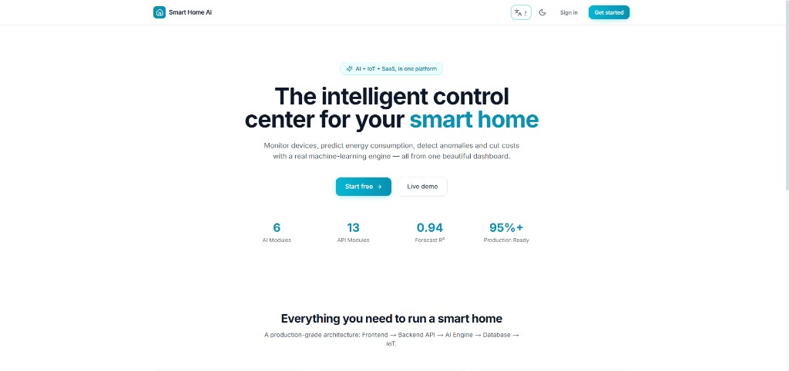
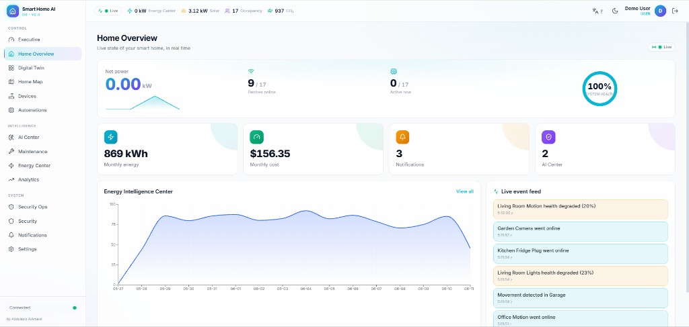
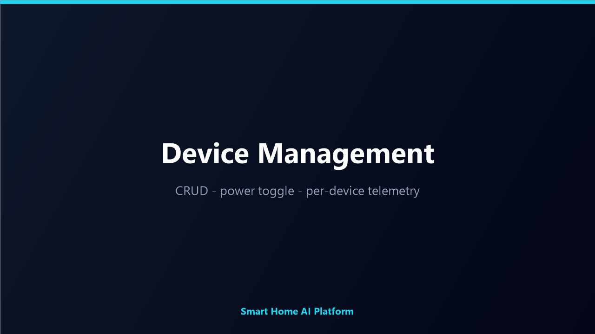
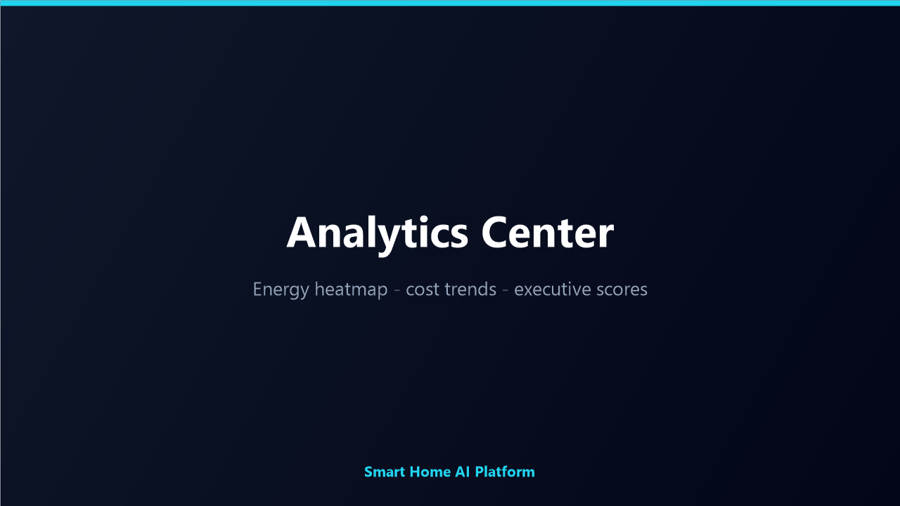
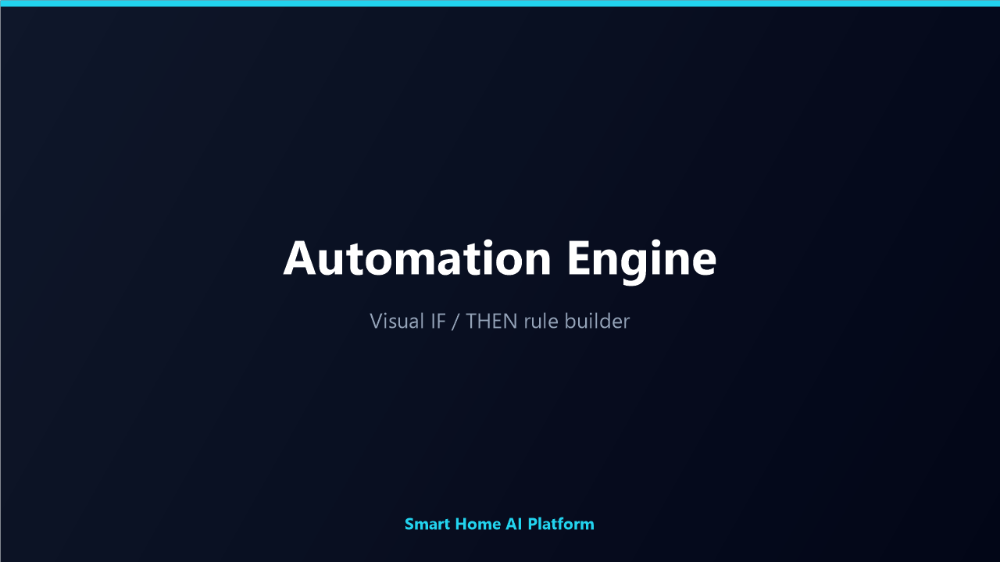
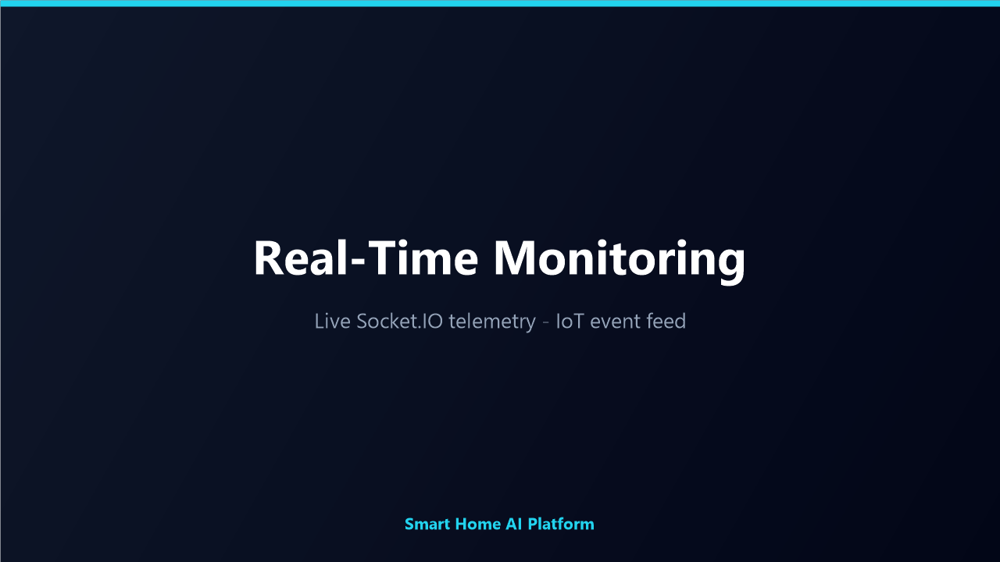

<div align="center">

#  Smart Home AI Platform

### AI-Powered Smart Home Operating System with IoT Integration, Real-Time Monitoring, Predictive Analytics & Intelligent Automation

[](https://nextjs.org/)
[](https://www.typescriptlang.org/)
[](https://fastapi.tiangolo.com/)
[](https://www.python.org/)
[](https://www.postgresql.org/)
[](https://socket.io/)
[](https://scikit-learn.org/)
[](https://www.docker.com/)
[](LICENSE)

**A production-grade Smart Home OS** combining real machine learning, IoT simulation, real-time telemetry, a digital twin, predictive maintenance, and a security operations center — all in one clean, full-stack monorepo.

### 🌐 Live Demo

| | |
|---|---|
| **Website** | [**frontend-production-41839.up.railway.app**](https://frontend-production-41839.up.railway.app) |
| **API** | [backend-production-bd68.up.railway.app](https://backend-production-bd68.up.railway.app) |
| **Demo login** | `demo@smarthome.ai` / `Demo123!` |
| **Admin login** | `admin@smarthome.ai` / `Admin123!` |

</div>

---

##  Table of Contents

- [Project Overview](#-project-overview)
- [Key Features](#-key-features)
- [Smart Home Architecture](#-smart-home-architecture)
- [Technology Stack](#-technology-stack)
- [AI Engine](#-ai-engine)
- [IoT Integration](#-iot-integration)
- [Real-Time Monitoring](#-real-time-monitoring)
- [Project Statistics](#-project-statistics)
- [Installation](#-installation)
- [Deployment Guide](#-deployment-guide)
- [Folder Structure](#-folder-structure)
- [Screenshots](#-screenshots)
- [Future Improvements](#-future-improvements)
- [Author](#-author)

---

##  Project Overview

The **Smart Home AI Platform** is a complete **Smart Home Operating System** that lets a homeowner monitor devices, forecast energy consumption, detect anomalies, schedule loads intelligently, and cut costs — driven by a **real scikit-learn machine-learning engine**, not mocks.

It is built as a professional **four-tier monorepo**, where each layer is independently deployable and communicates over clean HTTP/JSON contracts:

```
Frontend (Next.js) → Backend API (Express/TS) → AI Engine (FastAPI) → Database (PostgreSQL/Prisma)
```

The platform ships with **15 dashboard pages**, an **IoT simulation engine**, **real-time Socket.IO streaming**, full **JWT + RBAC security**, and **Arabic/English (RTL)** support.

---

##  Key Features

 **Real Machine Learning** — 6 trained scikit-learn models (energy, anomaly, usage, scheduling, cost, recommendations).
 **IoT Simulation Engine** — stateful fleet of ~20 devices across 7 rooms with live telemetry.
 **Real-Time Monitoring** — Socket.IO channels stream telemetry, IoT snapshots, and events every 3 seconds.
 **Executive Command Center** — home health, AI confidence, reliability, efficiency, security & savings scores.
 **Predictive Maintenance** — remaining lifespan, failure probability, risk tiers, and suggested service dates.
 **Security Operations Center (SOC)** — camera grid, door sensors, motion timeline.
 **Digital Twin & Home Map** — interactive room grid with live thermal and occupancy telemetry.
 **Explainable AI** — every recommendation surfaces reason, confidence, impact, and estimated savings.
 **Visual Automation Engine** — IF/THEN rule builder backed by full CRUD APIs.
 **Enterprise Security** — JWT with refresh-token rotation, RBAC, Zod validation, Helmet, rate limiting, audit logs.
 **Internationalization** — Arabic/English with full RTL layout toggle.
 **Production-Ready** — Dockerfiles, Docker Compose, Railway & Vercel configs.

---

##  Smart Home Architecture

```
┌──────────────────────────────────────────────────────────────────┐
│                         Presentation Layer                        │
│   Next.js 14 App Router · Tailwind · Recharts · Framer Motion      │
│   Socket.IO Client · i18n Arabic/English RTL                       │
└───────────────────────────────┬──────────────────────────────────┘
                                 │ REST (JSON, Bearer JWT) + WebSocket
┌───────────────────────────────▼──────────────────────────────────┐
│                        Application / API Layer                    │
│  Express + TypeScript · Routes → Controllers → Services → Prisma  │
│  Middleware: auth · rbac · validate (Zod) · audit · rate-limit    │
│  IoT Simulation Engine · Socket.IO Gateway                        │
└──────────────┬───────────────────────────────┬───────────────────┘
               │ Prisma ORM                     │ REST (JSON)
┌──────────────▼─────────────┐   ┌──────────────▼───────────────────┐
│        Persistence          │   │            AI Engine             │
│  PostgreSQL 16 · 13 models  │   │  FastAPI + scikit-learn          │
│  migrations + seed          │   │  6 ML modules + joblib           │
└─────────────────────────────┘   └──────────────────────────────────┘
```

> **Design principle:** Each layer is isolated. The backend holds no ML logic, the AI engine never touches the database, and the frontend never queries the database directly.

See [docs/ARCHITECTURE.md](docs/ARCHITECTURE.md) for the full design.

---

##  Technology Stack

| Layer | Technologies |
|-------|--------------|
| **Frontend** | Next.js 14, React 18, TypeScript 5, Tailwind CSS, Recharts, Framer Motion, Socket.IO Client |
| **Backend** | Node.js, Express, TypeScript, Prisma, Zod, JWT, Socket.IO, Swagger/OpenAPI |
| **AI Engine** | Python 3.13, FastAPI, scikit-learn, pandas, NumPy, joblib, pydantic |
| **Database** | PostgreSQL 16, Prisma ORM (13 models, migrations, seed) |
| **DevOps** | Docker, Docker Compose, Railway, Vercel, GitHub Actions |

---

##  AI Engine

Six **real, trained** machine-learning models served by FastAPI:

| Model | Endpoint | Algorithm | Purpose |
|-------|----------|-----------|---------|
| Energy Prediction | `POST /ai/energy/predict` | Gradient Boosting Regressor | 24-hour kWh forecast (R² ≈ 0.94) |
| Anomaly Detection | `POST /ai/anomaly/detect` | Isolation Forest | Detect faults & spikes |
| Usage Analysis | `POST /ai/usage/analyze` | KMeans | Cluster consumption patterns |
| Smart Scheduling | `POST /ai/schedule/optimize` | Tariff-aware optimization | Best run window |
| Cost Optimization | `POST /ai/cost/optimize` | Load shifting | Realizable savings |
| Recommendation Engine | `POST /ai/recommendations` | Model fusion | Priority-ranked advice |

Train and persist all models with:

```bash
cd ai-engine && python -m training.train
```

---

##  IoT Integration

The **IoT Simulation Engine** (`backend/src/lib/iotSimulator.ts`) maintains a stateful fleet of virtual smart-home devices:

- **~20 devices** across **7 rooms** (lights, thermostats, AC, locks, cameras, motion/door sensors, plugs, energy meters).
- **Per device:** online/offline state, battery drain, signal strength, health, and power draw.
- **Per room:** temperature, humidity, occupancy, and CO₂.
- **Events:** intrusion/motion alerts and device faults at three severity levels.

State evolves continuously and is exposed both over Socket.IO and via `GET /api/v1/iot/snapshot`.

---

##  Real-Time Monitoring

A Socket.IO gateway broadcasts three live channels every **3 seconds**:

| Channel | Payload |
|---------|---------|
| `iot` | Full snapshot of all devices and rooms |
| `telemetry` | Concise live summary |
| `event` | New events (alerts, faults, motion) |

The frontend consumes these to power the live dashboard, executive scores, SOC timeline, and digital twin.

---

##  Project Statistics

| | |
|---|---|
|  **Full-Stack Architecture** | 4 independently deployable tiers |
|  **AI-Powered Smart Home Platform** | 6 trained ML models |
|  **Real-Time Monitoring** | Socket.IO, 3 live channels |
|  **IoT Device Integration** | ~20 simulated devices, 7 rooms |
|  **Predictive Maintenance** | Lifespan & failure-probability scoring |
|  **Machine Learning Models** | scikit-learn (GBR, Isolation Forest, KMeans) |
|  **Docker Support** | Dockerfiles + Compose for the full stack |
|  **Production-Ready Deployment** | Railway + Vercel configs, CI workflow |

Additional metrics: **154 source files** · **55 TypeScript** · **30 React** · **17 Python** · **13 DB models** · **14 REST modules** · **15 dashboard pages** · **Jest 14/14** · **E2E 28/28**.

---

##  Installation

### Quick start (Docker)

> Requires Docker + Docker Compose.

```bash
cp .env.example .env
docker compose up --build
```

| Service | URL |
|---------|-----|
| Frontend | http://localhost:3001 |
| Backend | http://localhost:4010 |
| API docs | http://localhost:4010/api/docs |
| AI Engine | http://localhost:8010/docs |
| PostgreSQL | localhost:5433 |

### Local development

**1. AI Engine**
```bash
cd ai-engine
python -m venv .venv && .venv/Scripts/activate   # Windows
pip install -r requirements.txt
python -m training.train
uvicorn app.main:app --reload --port 8010
```

**2. Backend**
```bash
cd backend
npm install
cp .env.example .env
npx prisma migrate deploy
npx prisma db seed
npm run dev
```

**3. Frontend**
```bash
cd frontend
npm install
cp .env.example .env.local
npm run dev
```

### Default credentials

| Role | Email | Password |
|------|-------|----------|
| Admin | `admin@smarthome.ai` | `Admin123!` |
| User | `demo@smarthome.ai` | `Demo123!` |

---

##  Deployment Guide

The platform is cloud-ready for **Railway** (backend, AI engine) and **Vercel** (frontend).

1. **Database** — provision managed PostgreSQL; set `DATABASE_URL` with `sslmode=require`.
2. **Secrets** — generate fresh `JWT_ACCESS_SECRET` / `JWT_REFRESH_SECRET` (`openssl rand -hex 32`).
3. **Backend** — deploy with `backend/railway.json`; migrations run automatically on boot.
4. **AI Engine** — deploy with `ai-engine/railway.json`; point `AI_ENGINE_URL` to its internal URL.
5. **Frontend** — deploy with `frontend/vercel.json`; set `NEXT_PUBLIC_API_URL` to the public backend URL.
6. **CORS** — set `CORS_ORIGIN` to the production frontend domain.

Full guide: [docs/DEPLOYMENT.md](docs/DEPLOYMENT.md).

---

## 📁 Folder Structure

```
smart-home-ai-platform/
├── frontend/              # Next.js 14 dashboard (15 pages, Socket.IO, i18n)
│   ├── app/(app)/         # Protected dashboard routes
│   ├── components/        # Shared UI components
│   └── lib/               # API client, auth, realtime, scores, spatial
├── backend/               # Express REST API + Prisma
│   ├── src/modules/       # 14 REST modules (auth, devices, energy, iot…)
│   ├── src/lib/           # IoT simulator, realtime gateway, AI client
│   └── prisma/            # Schema, migrations, seed
├── ai-engine/             # FastAPI + scikit-learn microservice
│   ├── app/models/        # 6 ML model modules
│   └── training/          # Model training pipeline
├── docs/                  # Architecture, Database, API, Deployment, Report
│   └── screenshots/       # Portfolio screenshots
├── docker-compose.yml     # Full-stack orchestration
└── README.md
```

---

##  Screenshots

### Landing Page


### Home Dashboard — Real-Time Overview


### Device Management


### Analytics Center


### Automation Engine


### Real-Time Monitoring Panel


---

##  Future Improvements

-  Connect a real **MQTT bridge** to replace the simulation with physical devices.
-  Render the digital twin in **3D** using three.js / React Three Fiber (spatial layer already prepared).
-  Train a dedicated **survival model** for predictive maintenance.
-  Add push/email notification delivery and a mobile companion app.
-  Live cloud deployment with managed Postgres, TLS, backups, and uptime monitoring.

---

##  Author

**Abdulaziz AlAmawi** — sole project owner, developer and copyright holder.

For a full technical breakdown, see [docs/PROJECT-REPORT-EN.md](docs/PROJECT-REPORT-EN.md).

---

<div align="center">

**Built and Maintained by Abdulaziz AlAmawi**

MIT © 2026 Abdulaziz AlAmawi

</div>
